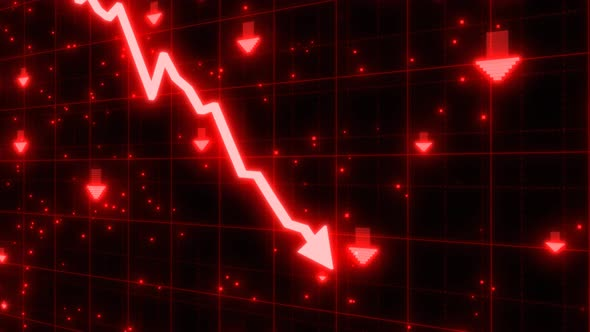
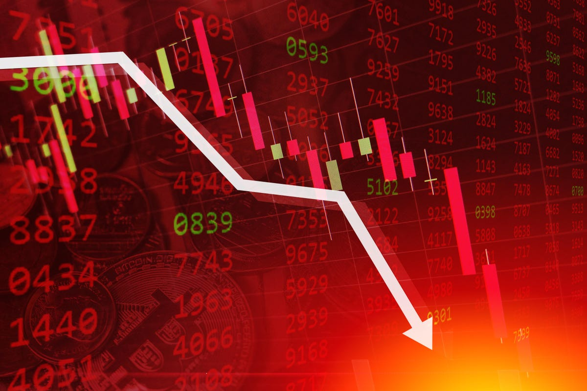
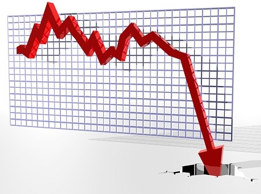

# Trading stocks is not easy

I don`t wanna sound like a _broken record_, but trading penny stocks and making shit ton of money doing it, is gonna take much more that a simple **twitter signal**. Trust me I have been doing it for over a year and I cant tell you a couple of reasons why you should not consider it.

## 1. You are not gonna get rich quick

Most people get to trading cuz its a super easy way of making money. But so is the lottery. You understand don`t you. It is just like every job on the planet, ur gonna work hard as fuck, and trust me you will wanna die. When you see something like this.

## 2. You will need to control yourself

Listen, you cant control your self. You think you have discipline? Trust me **You do not!**. I can hear you screaming "you do not know me". Ow really? How is that "new year new me" shit u said in 2021 doing. Exactly! Don`t tell me, I already know the excuses.

## 3. You are gonna lose before you win

You are gonna lose a lot of **MONEY**. Like go jump of a bridge level lose money. So unless you have thought about jumping of a plane with a parachute for fun. Then it is not for you. Cuz its a lot of risk when ur trading penny stock.

# Cheer up son

Listen, I know I beat you up but let me give you day dream about when you are going to work. My **P&L** of the last 14 months.

### Yea **_I turned 10k to 400K in less than 12 months_**.
